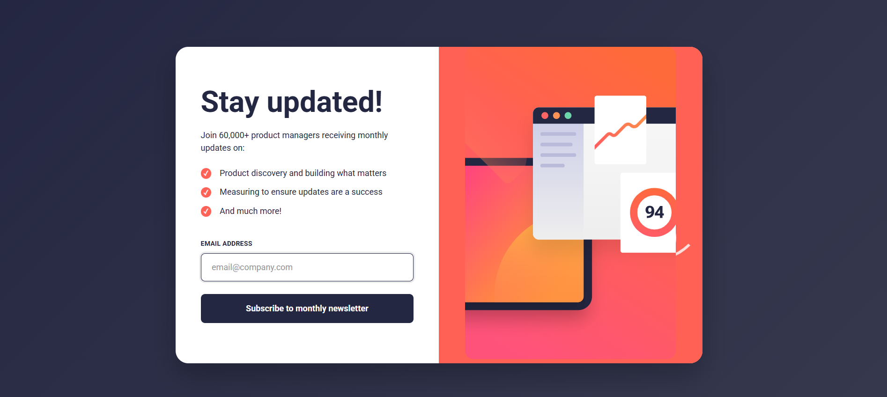
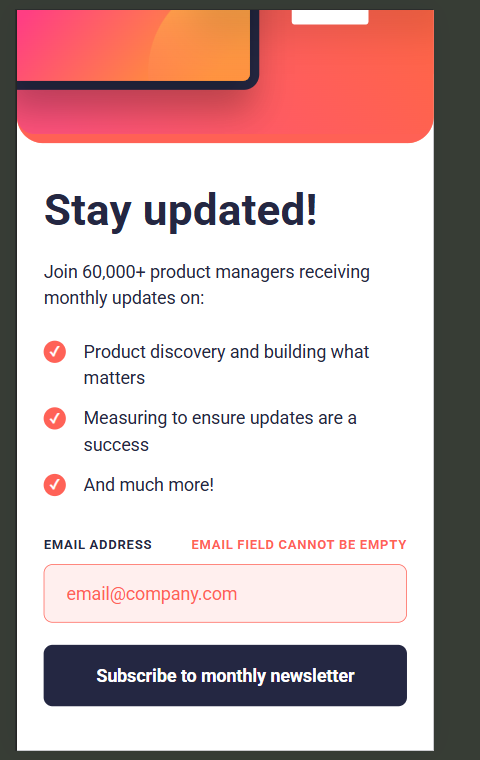
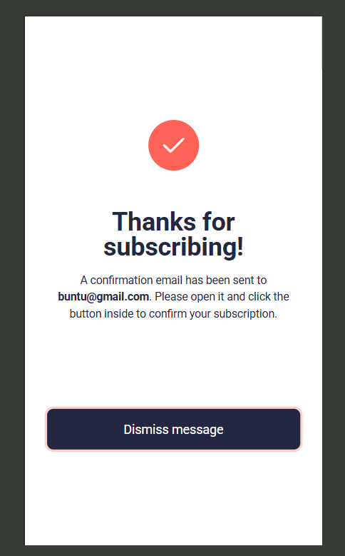

# Newsletter Subscription Form

A modern, responsive, and accessible newsletter subscription form built with HTML, CSS, and JavaScript.

## Features

- Responsive design for desktop and mobile
- Real-time email validation with user feedback
- Accessible form with ARIA attributes and keyboard navigation
- Animated modal confirmation on successful subscription
- Enhanced user experience with subtle animations and error handling

## Installation

1. Clone this repository:
   ```bash
   git clone <https://github.com/WilliamBuntu/newsletter-form-lab1>
   ```
2. Navigate to the project directory:
   ```bash
   cd form-lab
   ```
3. Open `index.html` in your browser.

## Usage

- Enter a valid email address and submit the form.
- If the email is valid, a confirmation modal will appear.
- Dismiss the modal to reset the form and subscribe again.

## Project Structure

- `index.html` – Main HTML file containing the form and modal.
- `styles.css` – All styles for layout, responsiveness, and animations.
- `scripts.js` – Handles form validation, modal logic, accessibility, and UX enhancements.
- `assets/images/` – Contains illustration images for desktop and mobile.

## Accessibility & UX

- ARIA roles and labels for screen readers
- Keyboard navigation and focus management
- Error messages are announced and visually clear
- Responsive layout adapts to all device sizes

## Screenshots





## License
 - Owned by [WilliamBuntu]


